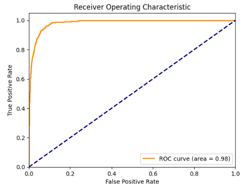
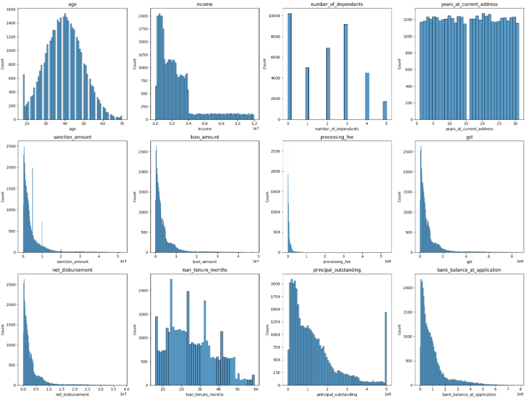
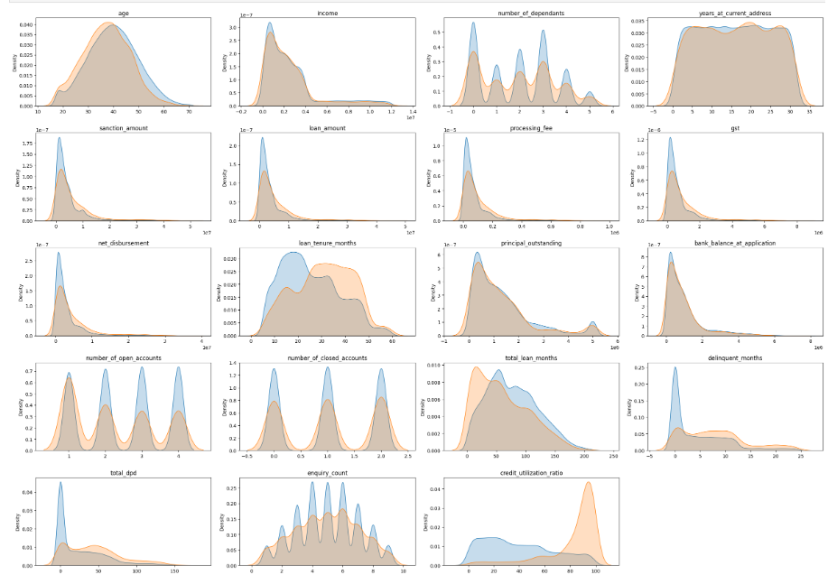
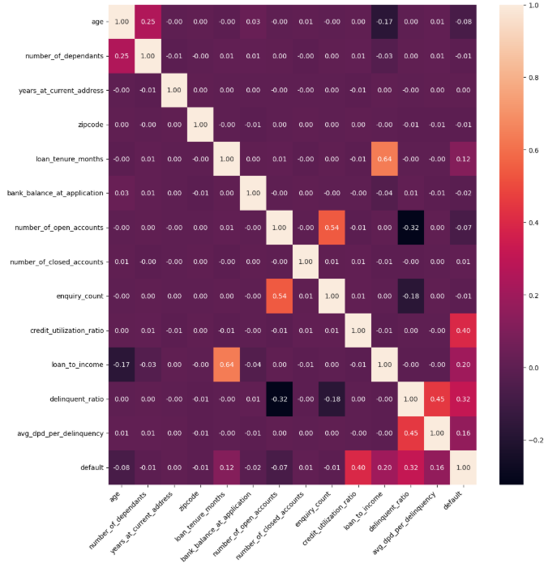
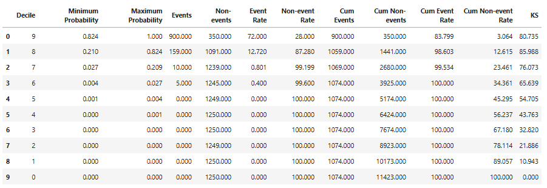
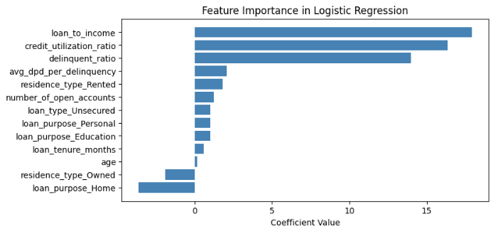

# Credit Risk Model — Loan Default Prediction

A credit risk scorecard model that predicts the probability of loan default using customer demographics, loan details, and credit bureau data, built with an emphasis on industry-standard credit risk evaluation techniques (WOE/IV feature selection, rank-ordering, KS-statistic, Gini coefficient).

## Results

### ROC Curve



## Table of Contents
- [Overview](#overview)
- [Dataset](#dataset)
- [Approach](#approach)
- [Modeling](#modeling)
- [Results](#results)
- [Setup & Installation](#setup--installation)
- [Live Demo](#live-demo)
- [Project Structure](#project-structure)
- [Limitations & Future Work](#limitations--future-work)

## Overview

Lenders need to estimate the likelihood that a loan applicant will default, both to make approval decisions and to price risk appropriately. This project builds an end-to-end credit risk model — from raw customer/loan/bureau data through feature engineering, feature selection, class-imbalance handling, and hyperparameter tuning — to a final, interpretable logistic regression scorecard, evaluated using the same statistical tools (KS-statistic, Gini, decile rank-ordering) used in real-world credit risk practice.

## Dataset

- **Source:** Three merged CSV files — `customers.csv`, `loans.csv`, `bureau_data.csv`
- **Size:** 50,000 records after merging on customer ID, 12,500 held out as a test set (75/25 split, stratified on target)
- **Target variable:** `default` (binary) — highly imbalanced: 45,703 non-defaults vs. 4,297 defaults (~8.6% default rate)
- **Feature groups:**
  | Category | Examples |
  |---|---|
  | Demographics | age, gender, marital status, number of dependants, residence type |
  | Loan details | sanction amount, loan amount, tenure, loan type/purpose, processing fee |
  | Bureau/credit history | open/closed accounts, delinquent months, total DPD (days past due), credit utilization ratio, enquiry count |

## Exploratory Data Analysis

### Distribution of Continuous Features


### KDE Plots of Key Predictors


## Approach

**1. Data cleaning**
- Missing `residence_type` imputed with the training-set mode
- Removed records where `processing_fee` exceeded 3% of `loan_amount` (data quality outliers)
- Standardized inconsistent category labels (e.g. `"Personaal"` → `"Personal"`)

**2. Feature engineering**
- `loan_to_income` — loan amount relative to income
- `delinquent_ratio` — % of loan tenure spent delinquent
- `avg_dpd_per_delinquency` — average days-past-due per delinquent month

**3. Feature selection**
- **Multicollinearity check** via Variance Inflation Factor (VIF) — dropped highly collinear fields (`sanction_amount`, `processing_fee`, `gst`, `net_disbursement`, `principal_outstanding`)
- **Information Value (IV)** via Weight of Evidence (WOE) binning — retained only features with IV > 0.02, a standard credit-scoring threshold for predictive usefulness

Final feature set (10 features): `age`, `residence_type`, `loan_purpose`, `loan_type`, `loan_tenure_months`, `number_of_open_accounts`, `credit_utilization_ratio`, `loan_to_income`, `delinquent_ratio`, `avg_dpd_per_delinquency`

## Feature Analysis

### Correlation Heatmap of Numeric Features


**4. Preprocessing**
- `MinMaxScaler` on numeric features
- One-hot encoding (`drop_first=True`) on categoricals

**5. Class imbalance handling**
Three strategies were tested: no handling, random under-sampling, and **SMOTETomek** (combined SMOTE over-sampling + Tomek-link under-sampling) — SMOTETomek was carried forward as it gave the best balance of precision/recall on the minority (default) class.

## Modeling

Three algorithms were evaluated — **Logistic Regression, Random Forest, and XGBoost** — with hyperparameters tuned via `RandomizedSearchCV` and, in a later iteration, **Optuna** (50 trials per model).

| Model | Tuning | Class Imbalance Handling |
|---|---|---|
| Logistic Regression | Optuna (50 trials, F1-macro objective) | SMOTETomek |
| XGBoost | Optuna (50 trials, F1-macro objective) | SMOTETomek |
| Random Forest | Default parameters | None |

**Final model: Logistic Regression** (Optuna-tuned, trained on SMOTETomek-resampled data) was selected as the production model — `C=5.93`, `solver='saga'`, `class_weight='balanced'`. While the tuned XGBoost model scored marginally higher on balanced precision/recall, logistic regression was chosen for its **interpretability** (coefficients map directly to a WOE/IV-style scorecard) and **transparency**, which are typically preferred in regulated credit risk settings.


## Results

Final model performance on the held-out test set (12,497 records):

| Metric | Class 0 (No Default) | Class 1 (Default) |
|---|---|---|
| Precision | 0.99 | 0.56 |
| Recall | 0.93 | 0.94 |
| F1-Score | 0.96 | 0.70 |

| Overall Metric | Score |
|---|---|
| **Accuracy** | 93% |
| **AUC-ROC** | **0.9837** |
| **Gini Coefficient** | **0.9674** |
| **KS-Statistic** | **85.99%** (peak separation at decile 8) |

**Rank-ordering (decile analysis):** the top decile alone captures 83.8% of all actual defaults, and the top two deciles together capture 98.6% — confirming strong discriminatory power and correct rank-ordering (higher predicted risk deciles consistently show higher actual default rates).

## Model Evaluation

### ROC Curve


### Decile Rank-Ordering Analysis


### Feature Importance


> ⚠️ **Note on the precision/recall trade-off:** the model favors **recall over precision** for defaulters (94% of actual defaulters are correctly flagged, at the cost of more false positives — precision of 56%). This is a deliberate choice appropriate for credit risk, where missing an actual defaulter is typically far costlier than over-flagging a safe borrower for manual review. 

## Setup & Installation

### Prerequisites
- Python 3.9+

### 1. Clone the repository
```bash
git clone https://github.com/adekoya759/ml-project-credit-risk-model
cd ml-project-credit-risk-model
```

### 2. Create a virtual environment and install dependencies
```bash
python -m venv venv
source venv/bin/activate      # On Windows: venv\Scripts\activate

pip install pandas numpy matplotlib seaborn scikit-learn xgboost imbalanced-learn statsmodels optuna joblib
```

### 3. Add the data
Place `customers.csv`, `loans.csv`, and `bureau_data.csv` in the project root (or update the file paths in the notebook to point to your data location).


## Live Demo

https://machine-learning-project-credit-risk-model.streamlit.app/

## Project Structure

```
credit-risk-model/
├── Credit_Risk_Model.ipynb       # Main notebook: cleaning, feature engineering, modeling, evaluation
├── artifacts/
│   └── model_data.joblib         # Saved final model + scaler + feature list (generated after training)
├── customers.csv                 # Raw customer data (not included — see Setup)
├── loans.csv                     # Raw loan data (not included — see Setup)
├── bureau_data.csv               # Raw credit bureau data (not included — see Setup)
└── README.md
```

## Limitations & Future Work

- The target class is heavily imbalanced (~8.6% default rate); while SMOTETomek helps, results on synthetic minority samples can be optimistic relative to a live production population — worth validating on a genuinely out-of-time sample if one becomes available.
- The final model swaps some precision for recall on defaulters (56% precision); a business-cost analysis (cost of a missed default vs. cost of a false flag) could be used to tune the classification threshold more precisely, rather than relying on the default 0.5 cutoff.
- No out-of-time validation was performed — train/test is a single random stratified split rather than a temporal (train on earlier loans, test on later ones) split, which is generally preferred for credit risk models being deployed in production.
- A full scorecard transformation (converting logistic regression coefficients into a points-based score, as is standard in credit bureaus) could make the model more directly usable by non-technical stakeholders.

---

## 👨‍💻 Author

**Oluwatobi Adekoya**

- 🌐 Portfolio: https://dantechonline.com.ng
